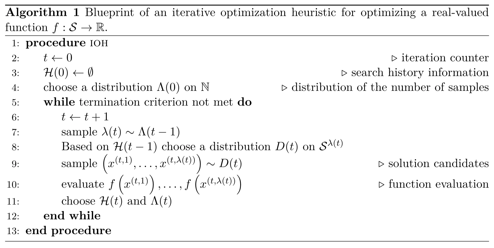
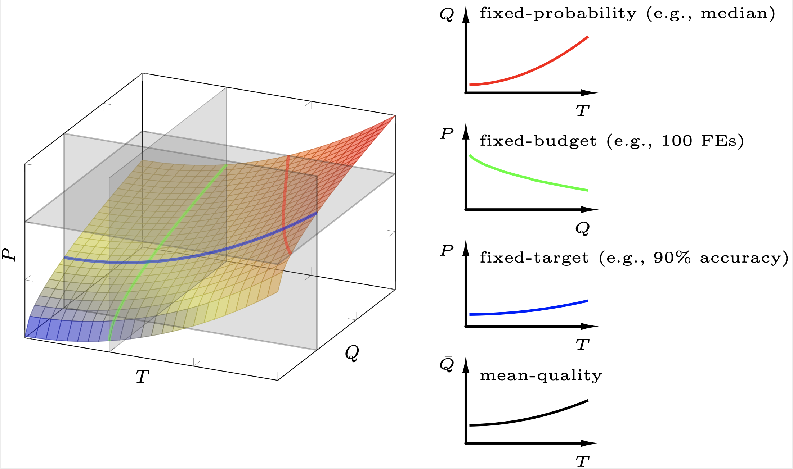

---
layout: page
title: Real-valued Black-Box Optimization
has_children: true
permalink: /Background
--- 

## Iterative Optimization Heuristics

We study the optimization of a problem $f\colon \mathcal{S} \rightarrow \mathbb{R}$, i.e., we assume our problem to be a single-objective, real-valued objective function, defined over a search space $\mathcal{S}$. We do not make any assumption on the set $\mathcal{S}$; it can be discrete or continuous, constrained or unconstrained.
We do not require that $f$ is explicitly modeled, i.e., $f$ can very well be a _black-box optimization problem_, for which we are able to evaluate the quality of points $x \in \mathcal{S}$ -- e.g., through computer simulations or through physical experiments -- but for which we do not have any other information. Intermediate _grey-box_ settings are also possible, e.g., when some information about the variable interaction is known. To ease notation, we nevertheless speak of black-box optimization in such cases, i.e., even when some a priori information about the problem $f$ is available. We emphasize that the query-based optimization algorithms studied in our work can be competitive even when the problem $f$ is explicitly known.

The class of algorithms that we are interested in are _Iterative Optimization Heuristics_ (IOHs). IOHs are entirely query-based, i.e., they sample the search space $\mathcal{S}$ and use the function values $f(x)$ of the evaluated samples $x$ to guide the search. The pseudo-code below provides a blueprint for such algorithms. Classical examples for IOHs are deterministic and stochastic local search algorithms (this class includes Simulated Annealing and Threshold Accepting as two prominent examples), genetic and evolutionary algorithms, Bayesian Optimization and related global optimization algorithms, Estimation of Distribution algorithms, and ant colony optimization algorithms.

## Selected Performance Indicators

Unlike in classical algorithmics, the most commonly studied performance measures in black-box optimization are based on the number of function evaluations. That is, instead of counting arithmetic operations or CPU time, we count the number of evaluations to determine the running time of an IOH.

As discussed above, many state-of-the-art IOHs are randomized in nature, therefore yielding random performance traces even when the underlying problem $f$ is deterministic. The performance space is therefore spanned by the number of evaluations, by the quality of the assessed solutions, and by the probability that the algorithm has found within a given budget of function evaluations a solution that is at least as good as a given quality threshold. The figure below illustrates this three-dimensional space.

<figure>
	
	<figcaption style="text-align: justify; font-size: 12px;">Three-dimensional performance space spanned by the running time ($T$), the quality of a best-so-far solution ($Q$), and the probability ($P$) of an algorithm reaching a given target within somebudget. Here, we draw an exemplary cumulative distribution surface over the $TQ$-plane. The fixed-probability analysis is performed by intersecting this surface with a horizontal plane (representing someprobability, e.g., the median success rate), where the resulting performance curve is marked in red and is also rendered in the two-dimensional space (the top sub-figure on the right). Similarly, the fixed-target and fixed-budget analyses are shown by those two vertical cutting planes and the corresponding two-dimensional renderings in blue and green (the middle two sub-figures), respectively. Here, we use 100 function evaluations (FEs) for the fixed-budget analysis and 90% accuracy of the solution quality (w.r.t. the optimal value) for the fixed-target one. In addition, we show a sub-figure of the mean quality ($\bar{Q}$) against the running time ($T$), which is also extensively used in performance analysis.</figcaption>
</figure>

To define the performance measures covered by **IOHanalyzer** we use the following notation. 
<ul> 
    <li> $\mathcal{F}$ denotes the set of problems under consideration. Each problem (or problem instance, depending on the context) $f \in \mathcal{F}$ is assumed to be a function $f\colon \mathcal{S} \rightarrow \mathbb{R}$. The _dimension_ of $\mathcal{S}$ is denoted by $d$. We often consider scalable functions that are defined for several or all dimensions $d \in \mathbb{N}$. In such cases, we make the dimension explicit.</li>
	<li> $\mathcal{A} = \{A_1, A_2, \ldots\}$ is the set of algorithms under consideration. </li>
	<li> $T(A,f,d,B,v,i) \in \mathbb{N} \cup \{\infty\}$ is a <i>fixed-target measure</i>. It denotes the number of function evaluations that algorithm $A$ needed, in its $i$-th run and when maximizing the $d$-dimensional variant of problem $f$, to find a solution $x$ satisfying $f(x) \ge v$. When $A$ did not succeed in finding such a solution within the maximal allocated budget $B$, $T(A,f,d,B,v,i)$ is set to $\infty$. Several ways to deal with such failures are considered in the literature, as we shall discuss in the next paragraphs.</li>
	<li> Similarly to the above, $V(A,f,d,b,i) \in \mathbb{R}$ is a <i>fixed-budget measure</i>. It denotes the function value of the best solution that algorithm $A$ evaluated within the first $b$ evaluations of its $i$-th run, when maximizing the $d$-dimensional variant of problem $f$.</li>
</ul>

## Fixed-Target Analysis

Given the aforementioned concepts, the <b>fixed-target analysis</b> focuses on the distribution of running time $T(A, f, d, v)$ at various given target values (thus called "fixed-target"), functions and dimensions, answering the question of how many evaluations are needed to identify a solution of a certain quality.

## Fixed-Budget Analysis

Similarly, the <b>fixed-budget analysis</b> focuses on the distribution of the best function value $V(A, f, d, t)$ at various given budget values (thus called "fixed-budget"), functions and dimensions, addressing the complementary question: what is the quality of the best solutions that can be identified within a given budget of function evaluations?

## Selected Performance Indicators

In order to assess the empirical performance of IOHs, some performance indicators should be adopted in **IOHprofiler**, ranging from simple descriptive statistics to empirical distribution functions of performance measures.

### Descriptive Statistics

<ul>
	<li> The average function value given a fixed budget value is simply
	$$ \bar{V}(t)=\frac{1}{r}\sum_{i=1}^r V(A,f,d,t,i). $$
    </li>
	<li>The <i>Penalized Average Runtime</i> (PAR-$c$ score) for a fixed target value is defined as
	$$
	\operatorname{PAR-c}(v)=\frac{1}{r}\sum_{i=1}^r \min\left\{T(A,f,d,B,v,i), cB\right\}, 
	$$
	i.e., the PAR-$c$ score is identical to the sample mean when all runs successfully identified a solution of quality at least $v$ within the given budget $B$, whereas non-successful runs are counted as $cB$. In <b>IOHanalyzer</b> we typically study the PAR-1 score, which, in abuse of notation, we also refer to as the mean.
    </li>
	<li> Apart from mean values, we are often interested in quantiles, and in particular in the <i>sample median</i> of the $r$ values $\left\{T(A,f,d,B,v,i\}\right)_{i=1}^r$ and $\left\{V(A,f,d,b,i\}\right)_{i=1}^r$, respectively. By default, <b>IOHanalyzer</b> calculates the $2\%, 5\%, 10\%, 25\%, 50\%, 75\%, 90\%, 95\%$, and $98\%$ percentiles (denoted as $Q_{2\%}, Q_{5\%},\ldots, Q_{98\%}$) for both running times and function values.
    </li>
	<li> We also study the <i>sample standard deviation</i> of the running times and function values, respectively.
    </li>
	<li>The <i>empirical success rate</i> is the fraction of runs in which algorithm $A$ reached the given target $v$. That is,  
	$$
		\widehat{p}_s = \sum_{i=1}^r\mathbb{1}(T(A,f,d,B,v,i) < \infty) / r,
	$$
	where $\mathbf{1}(\mathcal{E})$ is the characteristic function of the event $\mathcal{E}$.
    </li>
</ul>

### Expected Running Time

An alternative to the PAR-$c$ score is the expected running time (ERT). ERT assumes independent restarts of the algorithm whenever it did not succeed in finding a solution of quality at least $v$ within the allocated budget $B$. Practically, this corresponds to sampling indices $i \in \{1,\ldots, r\}$ (i.i.d. uniform sampling with replacement) until hitting an index $i$ with a corresponding value $T(A,f,d,B,v,i) < \infty$. The running time would then have been $m B + T(A,f,d,B,v,i)$, where $m$ is the number of sampled indices of unsuccessful runs. The average running time of such a hypothetically restarted algorithm is then estimated as  

$$
	\operatorname{ERT}(A,f,d,B,v)
	= \frac{\sum_{i=1}^{r} \min\left\{T(A,f,d,B,v,i), B\right\}}{r \widehat{p}_s}= \frac{\sum_{i=1}^{r} \min\left\{T(A,f,d,B,v,i), B\right\}}{\sum_{i=1}^r\mathbf{1}(T(A,f,d,B,v,i) < \infty)}.
$$

Note that ERT can take an infinite value when none of the runs was successful in identifying a solution of quality at least $v$.

### Empirical Cumulative Distribution Functions

For the fixed-target and fixed-budget analysis, **IOHanalyzer** estimates probability density (mass) functions and computes empirical cumulative distribution functions (ECDFs). For the fixed-budget function value, its probability density function of is estimated via the well-known Kernel Density Estimation (KDE) method. For the fixed-target running time (an integer-valued random variable), we estimate its probability mass function by treating it as a real value and applying the KDE method. 

For a set of fixed-target running times, its ECDF is defined as

$$\widehat{F}_T(t\; ; \; A, f, d, v)=\sum_{i=1}^r \mathbf{1}(T(A,f,d,v,i) \leq t).$$

In addition, it is informative to gain the overview on ECDFs over a range of target values, resulting in an overall performance for some algorithm $A$. In **IOHanalyzer**, two levels of "aggregations" of ECDFs are implemented:
<ul>
    <li>The aggregation over _target values_ is defined in the following sense: for a set of target values $\mathcal{V}$, $r$ number of independent runs on each function, the aggregated ECDF is:
        $$
        \widehat{F}_T(t\; ; \; A,f,d,\mathcal{V}) = \frac{1}{r|\mathcal{V}|}\sum_{v\in \mathcal{V}}\sum_{i=1}^{r} \mathbf{1}(T(A,f,d,v,i) \leq t).
        $$
    </li>
    <li> Given a set of functions $\mathcal{F}$, the ECDF can be aggregated over $\mathcal{F}$:
    $$
    \widehat{F}_T(t \; ; \; A,\mathcal{F},d,\mathcal{V}) = \frac{1}{r|\mathcal{V}||\mathcal{F}|}\sum_{f\in\mathcal{F}}\sum_{v\in \mathcal{V}}\sum_{i=1}^{r} \mathbf{1}(T(A,f,d,v,i) \leq t).
    $$
    </li>
</ul>
The aggregated ECDFs for function values $V(A,f,d,t,i)$ can be defined in the similar manner.
