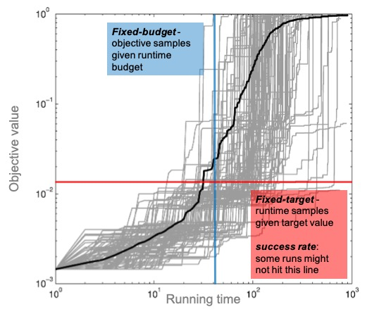

---
layout: page
title: Real-valued Black-Box Optimization
has_children: true
permalink: /Background
--- 

## General Setup

The so-called real-valued black-box benchmarking problem is considered, where objective functions defined as $f\colon \mathcal{S} \rightarrow \mathbb{R}$ are subject to optimization. Without loss of generality, we only consider the **maximization** problem here. Moreover, in order to perform a fair benchmarking task, the objective function $f$ should be considered a **black-box** for the optimization algorithms under testing, namely the only accessible information on $f$ is the objective function value (any analytical information on $f$ should not be exposed to algorithms). In this setting, the performance of an optimization algorithm can only be measured empirically, by means of either

1. the number of function evaluations (a.k.a. running time) $T$ taken to reach a target function value $v\in\mathbb{R}$, or
2. the function value $V$ obtained by consuming a given number of function evaluations (a.k.a. budget).

Here, an important assumption is made about algorithms: their running time is determined solely by the number of function evaluations, instead of considering the wall clock time of the function evaluation procedure, or the CPU time of those algorithms. This is a reasonable consideration due to the following facts: 1) measuring the actual execution time of the algorithm differs from one machine to the other, resulting in incomparable results if the data are obtained from different users, and 2) it is known from the theory field that the number of function evaluations characterizes the complexity of those algorithms.

Here, we shall introduce some important notations and concepts that will be used throughout the documentation:
<ul> 
    <li>A set of test functions: $\mathcal{F} = \{f_1, f_2, \ldots\}$, where $f_i\colon \mathcal{S} \rightarrow \mathbb{R}$.</li>
    <li>The dimensionality $d$: as with the previous point, the domain of function $\mathcal{S}$ is usually assumed to be a (subset of) linear space and hence $d$ is used to denote its dimension.</li>
    <li>A set of optimization algorithms: $\mathcal{A} = \{A_1, A_2, \ldots\}$. In this documentation, $\mathcal{A}$ is restricted to a sub-class of algorithms, called Iterative Optimization Heuristics.</li>
    <li>On a given function $f\in\mathcal{F}$, the running time $T$ (counted in number of function evaluations) that an algorithm $A\in\mathcal{A}$ takes to hit a target function value $v\in\mathbb{R}$ for _the first time_ is a $\mathbb{N}_{>0}$-valued random variable. In practice, it is not feasible to execute an algorithm until it hits the required target (it might take infinite time). Consequently, an upper bound $B$ (a.k.a. benchmarking budget) is typically imposed on the number of function evaluations. Using the extended real-line, the image of $T$ is restricted to $[0..B]\cup \{\infty\}$ (the running time is marked as "infinite" if the target value is not hit upon termination). To represent such a definition, the running time is indexed by a tuple consisting of (algorithm, function, dimension, target value):
        $$T(A, f, d, v) \in [0..B]\cup \{\infty\}.$$
    Note that such indices shall be dropped when no ambiguity is created. In black-box optimization, the general goal is to estimate the distribution of $T$, e.g., the so-called empirical cumulative distribution function (ECDF), by means of independent repetitions of the experiment on a tuple of $(A, f, d)$. Such repetitions are more commonly called _independent runs_ in the Evolutionary Computation literature, which essentially performs the simple random sampling of $T$. A random sample obtained from $r$ independent runs is thus denoted as:
    $$\{t_1(A, f, d, v), t_2(A, f, d, v), \ldots, t_r(A, f, d, v)\}.$$
    Again, when no ambiguity is created, we shall abbreviate it as $\{t_i\}_{i=1}^r$.</li>
    <li>Consuming a number of function evaluations $t\in \mathbb{N}_{>0}$, the best function value $V$ reached by an algorithm $A\in\mathcal{A}$ on function $f\in\mathcal{F}$ is a $\mathbb{R}$-valued random variable. As with the notation of running time $T$, the best function value (and a random sample of it) is denoted as:
    $$V(A, f, d, t) \in \mathbb{R}, \{v_1(A, f, d, t), v_2(A, f, d, t), \ldots, v_r(A, f, d, t)\}.$$
    It is worthwhile to clarify that the value $t$, that serves as a "check point" on function evaluations will also be referred to as _budget_ throughout the paper because taking a look at the best function value achieved by using $t$ is virtually the same as if the benchmarking budget $B$ were set to $t$ (although the actual optimization process would not stop at $t$).</li>
</ul>

## Fixed-Target Analysis

Given the aforementioned concepts, the <b>fixed-target analysis</b> focuses on the distribution of running time $T(A, f, d, v)$ at various given target values (thus called "fixed-target"), functions and dimensions, answering the question of how many evaluations are needed to identify a solution of a certain quality.

## Fixed-Budget Analysis

Similarly, the <b>fixed-budget analysis</b> focuses on the distribution of the best function value $V(A, f, d, t)$ at various given budget values (thus called "fixed-budget"), functions and dimensions, addressing the complementary question: what is the quality of the best solutions that can be identified within a given budget of function evaluations?

